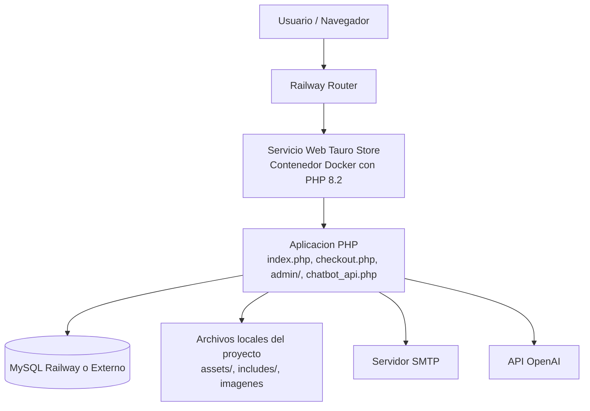
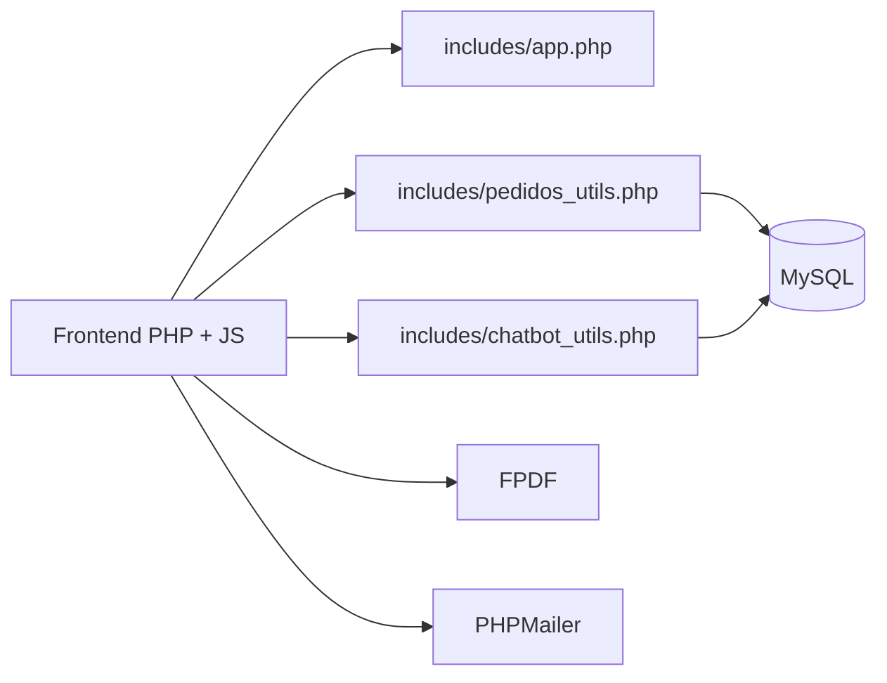

# TAURO STORE - Manual de Director

**Versión 1.0 | Abril 2026**

---

## Resumen Ejecutivo

**Tauro Store** es una aplicación e-commerce completa para venta de ropa y accesorios. Stack: PHP 8.2, MySQL, JavaScript vanilla.

- ✅ Catálogo de productos
- ✅ Carrito y checkout con validaciones
- ✅ Sistema de facturación PDF
- ✅ Panel administrativo
- ✅ Chatbot de soporte
- ✅ Pruebas unitarias incluidas

---

## Tecnologías usadas

### Backend

- PHP 8.2+
- PDO para acceso a MySQL
- MySQL / MariaDB
- PHPMailer para envío de correos
- FPDF para generación de facturas PDF

### Frontend

- HTML5
- CSS3
- JavaScript
- Bootstrap

### Testing

- PHPUnit 11
- Suite unitaria propia del proyecto en `tests/`

### Infraestructura

- XAMPP para entorno local en Windows
- Docker para empaquetado
- Railway para despliegue del contenedor

---

## Estructura general del proyecto

```text
integrador-main/
├── admin/                        # Panel administrativo (usuarios, pedidos, productos)
├── assets/                       # CSS, JS, imágenes
├── includes/
│   ├── app.php                   # Core (sesión, CSRF, flashes)
│   ├── conexion.php              # Conexión BD
│   ├── pedidos_utils.php         # Lógica de pedidos y envíos
│   ├── chatbot_utils.php         # Chatbot
│   └── business_rules.php        # Reglas de negocio puras
├── tests/                        # Pruebas unitarias PHPUnit
├── Dockerfile                    # Para despliegue en Railway
├── composer.json                 # Dependencias (PHPMailer, PHPUnit)
└── README.md                     # Documentación principal
```

---

## Diagrama de despliegue



---

## Arquitectura funcional simplificada



---

## Seguridad aplicada en el proyecto

- Tokens CSRF para formularios sensibles.
- Validación de sesión de usuario.
- Normalización de datos de usuario.
- `basename()` para endurecer manejo de rutas de imágenes.
- Uso de PDO.
- Token público para consulta limitada de factura.
- Validaciones de cantidad, tallas, estados y entrada del carrito.

---

## Estado actual del proyecto

El sistema está preparado para:

- ejecución local con XAMPP,
- despliegue en Railway mediante Docker,
- conexión a MySQL por variables de entorno,
- ejecución de pruebas unitarias.

