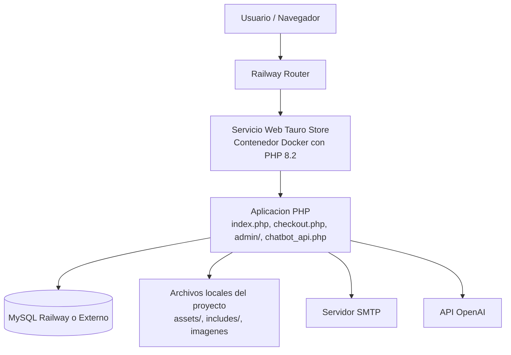
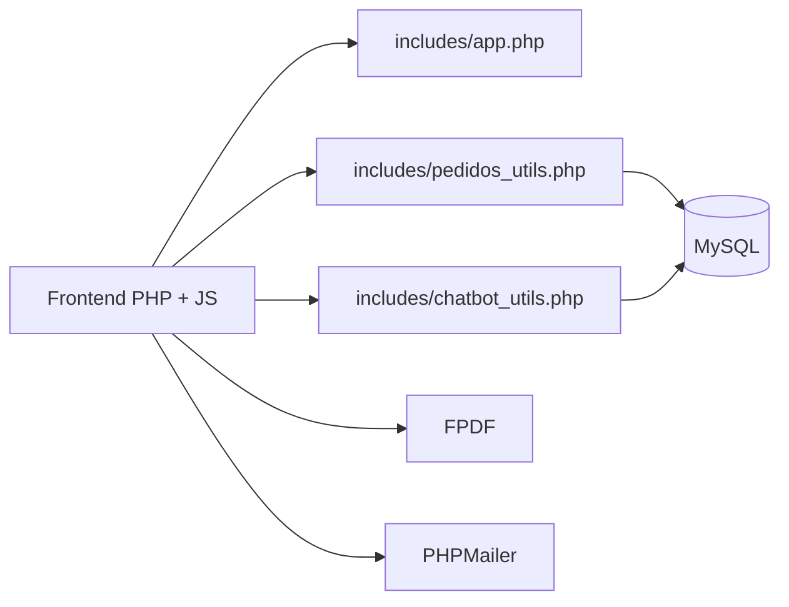

# TAURO STORE - Manual de Director

**Versión 1.0 | Abril 2026**

---

## Resumen Ejecutivo

**Tauro Store** es una aplicación e-commerce completa para venta de ropa y accesorios. Stack: PHP 8.2, MySQL, JavaScript vanilla.

- Catálogo de productos con búsqueda
- Carrito y checkout con validaciones
- Sistema de facturación PDF
- Panel administrativo completo
- Chatbot de soporte y consultas
- Pruebas unitarias incluidas

---

## Tecnologías usadas

### Backend

- PHP 8.2+
- PDO para acceso a MySQL
- MySQL / MariaDB
- PHPMailer para envío de correos
- FPDF para generación de facturas PDF

### Frontend

- HTML5
- CSS3
- JavaScript
- Bootstrap

### Testing

- PHPUnit 11
- Suite unitaria propia del proyecto en `tests/`

### Infraestructura

- XAMPP para entorno local en Windows
- Docker para empaquetado
- Railway para despliegue del contenedor

---

## Estructura general del proyecto

```text
integrador-main/
├── admin/                        # Zona administrativa: usuarios, pedidos, productos
├── assets/                       # Estilos, scripts, imágenes del sitio
├── includes/
│   ├── app.php                   # Motor principal (sesión, CSRF, flashes, utilidades)
│   ├── conexion.php              # Conexión a la base de datos
│   ├── pedidos_utils.php         # Lógica para gestión de pedidos y envíos
│   ├── chatbot_utils.php         # Chatbot conversacional
│   └── business_rules.php        # Reglas de negocio sin dependencias de BD
├── tests/                        # Pruebas unitarias con PHPUnit
├── Dockerfile                    # Configuración para despliegue
├── composer.json                 # Dependencias (PHPMailer, PHPUnit, etc.)
└── README.md                     # Documentación principal
```

---

## Diagrama de despliegue



---

## Arquitectura funcional simplificada



---

## Seguridad aplicada en el proyecto

- Tokens CSRF para todas las acciones sensibles.
- Validación de sesión antes de operaciones administrativas.
- Preparación de consultas SQL con PDO.
- Normalización de entrada de usuarios.
- Uso de `basename()` para rutas de archivos.
- Tokens públicos para consultas limitadas de facturas.
- Validaciones de cantidad, tallas, estados y datos del carrito.

---

## Estado actual del proyecto

El sistema está preparado para:

- ejecución local con XAMPP,
- despliegue en Railway mediante Docker,
- conexión a MySQL por variables de entorno,
- ejecución de pruebas unitarias.

---

## Instalación local

### Requisitos mínimos

- XAMPP 8.0+ (PHP 8.2, Apache, MySQL)
- Windows / Linux / Mac
- Git (opcional pero recomendado)

### Pasos

#### 1. Clonar o descargar el proyecto

```powershell
# Opción 1: Clonar desde Git
git clone <repositorio> C:\xampp\htdocs\integrador-main

# Opción 2: O descargar ZIP y extraer en C:\xampp\htdocs\
```

#### 2. Iniciar servicios en XAMPP

1. Abre **XAMPP Control Panel**
2. Inicia **Apache** y **MySQL**
3. Verifica que ambos muestren "Running" en verde

#### 3. Crear base de datos

```sql
-- En phpMyAdmin (http://localhost/phpmyadmin)
CREATE DATABASE tiendaropa CHARACTER SET utf8mb4 COLLATE utf8mb4_unicode_ci;
```

#### 4. Importar migraciones

1. Ve a phpMyAdmin → Base de datos `tiendaropa`
2. Tab **Importar** → Carga `migracion_realismo.sql`
3. Ejecuta

#### 5. Instalar dependencias

```powershell
cd C:\xampp\htdocs\integrador-main
composer install
```

#### 6. Verificar acceso

Abre navegador: `http://localhost/integrador-main`

Deberías ver la tienda funcionando.

---

## Instalación en Railway

### Requisitos

- Cuenta en [Railway.app](https://railway.app)
- Repositorio en GitHub con este código
- Servicio MySQL provisionado en Railway

### Pasos

#### 1. Conectar repositorio

1. Inicia sesión en Railway
2. **New Project** → **GitHub Repo** → Selecciona tu repositorio
3. Railway detectará el `Dockerfile` automáticamente

#### 2. Agregar servicio MySQL

1. Dashboard → **+ New** → **MySQL**
2. Aguarda a que se provisione
3. Railway inyectará automáticamente variables de base de datos

#### 3. Configurar variables de entorno (si es necesario)

Ve a tu servicio web en Railway → **Variables** y agrega:

```
# SMTP para correos (opcional pero recomendado)
SMTP_HOST=smtp.gmail.com
SMTP_PORT=587
SMTP_USER=tu_email@gmail.com
SMTP_PASS=tu_contraseña_app
SMTP_FROM=noreply@tauroropa.com

# OpenAI para chatbot (opcional)
OPENAI_API_KEY=sk-...
OPENAI_CHATBOT_MODEL=gpt-4

# Aplicación
APP_URL=https://tu-dominio-railway.app
```

#### 4. Desplegar

1. Sube cambios a GitHub
2. Railway detecta push y construye imagen Docker
3. Contenedor inicia automáticamente
4. Obtén URL pública en Railway dashboard

---

## Variables de entorno importantes

### Base de datos

Railway inyecta automáticamente:
- `MYSQLHOST`
- `MYSQLDATABASE`
- `MYSQLUSER`
- `MYSQLPASSWORD`
- `MYSQLPORT`

Para base de datos externa (si aplica):
- `DB_HOST`
- `DB_NAME`
- `DB_USER`
- `DB_PASS`

### Correo SMTP

- `SMTP_HOST`
- `SMTP_PORT`
- `SMTP_USER`
- `SMTP_PASS`
- `SMTP_FROM`

### Chatbot / OpenAI

- `OPENAI_API_KEY`
- `OPENAI_CHATBOT_MODEL`

---

## Verificación rápida

### Local: Checklist

- Acceso a `http://localhost/integrador-main` carga sin errores
- Catálogo visible y puedo navegar productos
- Carrito funciona: puedo agregar/eliminar items
- Checkout: puedo hacer una compra de prueba
- Admin: acceso a panel administrativo con credenciales

### Producción: Checklist

- URL pública responde
- Catálogo visible y funcional
- Conexión a BD correcta (datos presentes)
- Correos salen si está configurado SMTP

---

## Problemas comunes y soluciones

| Problema | Solución |
|----------|----------|
| "Connection refused" | Verifica que MySQL esté running en XAMPP |
| Error "tiendaropa database not found" | Ejecuta paso de crear BD |
| Imágenes rotas en local | Verifica permisos en `assets/img/` |
| En Railway: "Bad gateway" | Espera 2-3 minutos tras deploy. Verifica logs. |
| Correos no salen | Valida credenciales SMTP en variables de entorno |

---

## Comandos útiles

### Local

```powershell
composer install
php tools/phpunit.phar
php -S localhost:8000
Get-Content C:\xampp\apache\logs\error.log -Tail 20
```

### Railway

```bash
railway logs --follow
railway status
git push
```

