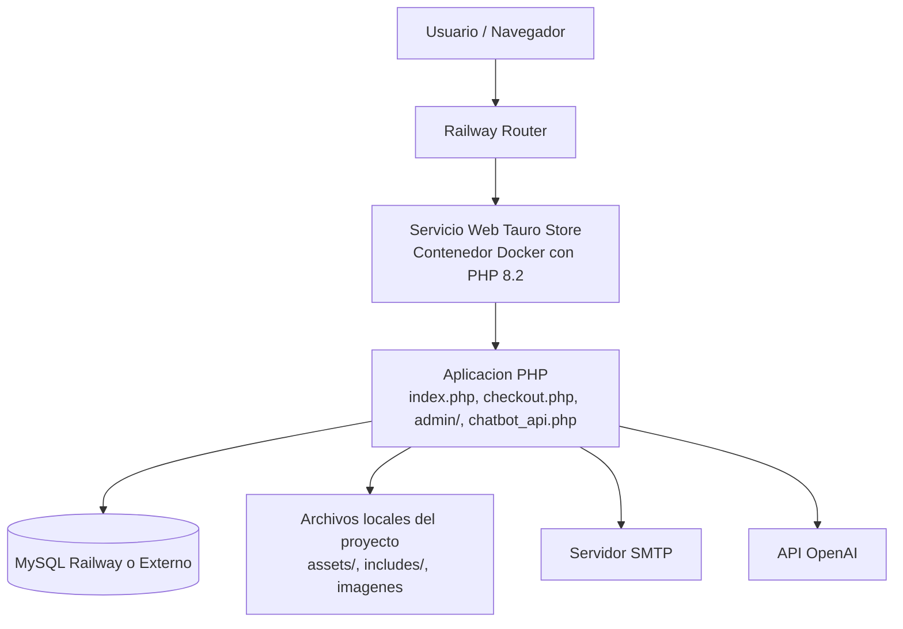
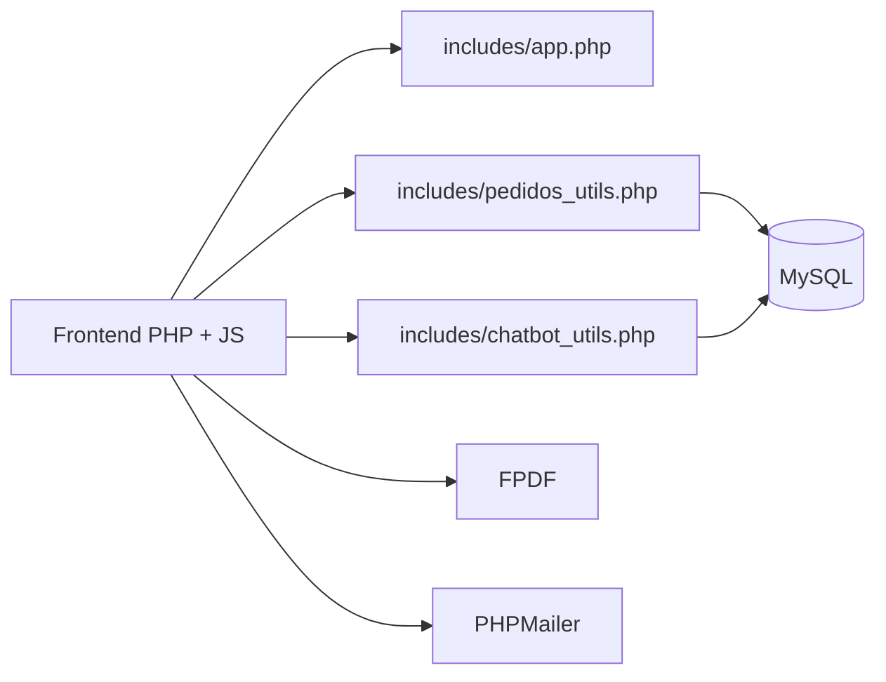

# Tauro Store

Aplicación web e-commerce para venta de ropa y accesorios masculinos. El proyecto permite navegación de catálogo, detalle de producto, carrito, checkout, generación de factura, seguimiento de pedido y administración de productos, pedidos y usuarios.

## Resumen

Tauro Store está construido como una aplicación PHP tradicional renderizada en servidor, con frontend estático apoyado en JavaScript, persistencia en MySQL y utilidades para correo, PDF y chatbot. El proyecto puede ejecutarse localmente con XAMPP o desplegarse en Railway usando el `Dockerfile` incluido.

## Tecnologías usadas

### Backend

- PHP 8.2+
- PDO para acceso a MySQL
- MySQL / MariaDB
- PHPMailer para envío de correos
- FPDF para generación de facturas PDF

### Frontend

- HTML5
- CSS3
- JavaScript
- Bootstrap

### Testing

- PHPUnit 11
- Suite unitaria propia del proyecto en `tests/`

### Infraestructura

- XAMPP para entorno local en Windows
- Docker para empaquetado
- Railway para despliegue del contenedor

## Funcionalidades principales

- Registro, login y cierre de sesión.
- Gestión de sesión de usuario.
- Catálogo de productos.
- Carrito persistido del lado del cliente.
- Checkout con validaciones y CSRF.
- Cálculo de envío por ciudad y zona.
- Generación de pedido y detalle de pedido.
- Factura PDF y factura pública verificable por token.
- Historial y transición de estados de pedidos.
- Panel administrativo para productos, pedidos y usuarios.
- Chatbot con respuestas de apoyo y consulta pública de pedidos por token.

## Estructura general del proyecto

```text
integrador-main/
├── admin/                  Panel administrativo
├── assets/                 CSS, JS e imágenes
├── includes/               Utilidades, conexión, app core, PDF, chatbot
├── tests/                  Pruebas unitarias
├── tools/                  Herramientas locales como phpunit.phar
├── vendor/                 Dependencias instaladas
├── index.php               Inicio
├── productos.php           Catálogo
├── producto.php            Detalle de producto
├── carrito.php             Carrito
├── checkout.php            Proceso de compra
├── ver_pedido.php          Consulta privada de pedido
├── factura_pdf.php         Factura PDF
├── factura_publica.php     Verificación pública por token
├── chatbot_api.php         Endpoint del chatbot
├── Dockerfile              Imagen para despliegue
└── README.md               Documentación principal
```

## Archivos importantes

### Núcleo de aplicación

- `includes/app.php`
  Manejo de sesión, CSRF, mensajes flash, utilidades de imágenes y redirección.

- `includes/conexion.php`
  Conexión principal a la base de datos. Detecta variables de Railway como `MYSQLHOST`, `MYSQLDATABASE`, `MYSQLUSER`, `MYSQLPASSWORD` y `MYSQLPORT`.

- `includes/pedidos_utils.php`
  Lógica de normalización, estados de pedido, transiciones, tarifas de envío e historial.

- `includes/chatbot_utils.php`
  Utilidades del chatbot, scoring de intención, catálogo, extracción de token y soporte a OpenAI.

- `includes/business_rules.php`
  Reglas de negocio puras agregadas para pruebas unitarias.

### Flujos de negocio

- `checkout.php`
  Validación del carrito, cálculo de envío, creación del pedido, detalle, PDF y correo.

- `ver_pedido.php`
  Consulta del pedido por usuario autenticado.

- `factura_publica.php`
  Exposición controlada de factura mediante token público.

### Infraestructura

- `Dockerfile`
  Imagen PHP 8.2 CLI que instala extensiones MySQL y expone la app con `php -S 0.0.0.0:$PORT`, compatible con Railway.

## Base de datos

La aplicación usa MySQL. En local, si no defines variables de entorno, el proyecto cae por defecto sobre:

- `DB_HOST=127.0.0.1`
- `DB_NAME=tiendaropa`
- `DB_USER=root`
- `DB_PASS=`

En Railway, la conexión ya contempla variables administradas por la plataforma:

- `MYSQLHOST`
- `MYSQLDATABASE`
- `MYSQLUSER`
- `MYSQLPASSWORD`
- `MYSQLPORT`

## Variables de entorno relevantes

### Base de datos

- `DB_HOST`
- `DB_NAME`
- `DB_USER`
- `DB_PASS`
- `MYSQLHOST`
- `MYSQLDATABASE`
- `MYSQLUSER`
- `MYSQLPASSWORD`
- `MYSQLPORT`

### Correo SMTP

- `SMTP_HOST`
- `SMTP_PORT`
- `SMTP_USER`
- `SMTP_PASS`
- `SMTP_FROM`
- `SMTP_SECURE`

### Chatbot / OpenAI

- `OPENAI_API_KEY`
- `OPENAI_CHATBOT_MODEL`
- `OPENAI_CHATBOT_REASONING`

## Ejecución local

### Opción 1: XAMPP

1. Coloca el proyecto dentro de `htdocs`.
2. Levanta Apache y MySQL desde XAMPP.
3. Crea la base de datos.
4. Importa tu estructura y datos iniciales.
5. Ejecuta también `migracion_realismo.sql`.
6. Asegura que las variables de entorno de base de datos correspondan a tu entorno local si no usarás los valores por defecto.
7. Abre el proyecto desde navegador.

Ejemplo:

```text
http://localhost/integrador-main
```

### Opción 2: servidor embebido de PHP

```powershell
php -S localhost:8000
```

Luego:

```text
http://localhost:8000
```

## Despliegue en Railway

## Cómo funciona en este proyecto

El despliegue en Railway se soporta mediante el `Dockerfile`. Railway construye la imagen, asigna un puerto dinámico y ejecuta la app con:

```dockerfile
CMD php -S 0.0.0.0:$PORT
```

Eso evita fijar un puerto manual y permite que Railway enrute el tráfico al contenedor correctamente.

## Requisitos para Railway

- Repositorio con este proyecto.
- Servicio web en Railway apuntando al repositorio.
- Base de datos MySQL provisionada en Railway o conexión externa equivalente.
- Variables de entorno cargadas en el servicio.

## Variables recomendadas en Railway

Si usas MySQL provisionado por Railway, normalmente la plataforma inyecta:

- `MYSQLHOST`
- `MYSQLDATABASE`
- `MYSQLUSER`
- `MYSQLPASSWORD`
- `MYSQLPORT`

Si decides usar nombres propios, deja además:

- `DB_HOST`
- `DB_NAME`
- `DB_USER`
- `DB_PASS`

Para funcionalidades extra:

- `OPENAI_API_KEY`
- `SMTP_HOST`
- `SMTP_PORT`
- `SMTP_USER`
- `SMTP_PASS`
- `SMTP_FROM`
- `SMTP_SECURE`

## Flujo recomendado de despliegue

1. Subir cambios al repositorio.
2. Conectar el repositorio a Railway.
3. Crear servicio MySQL en Railway o enlazar una base externa.
4. Configurar variables de entorno.
5. Desplegar.
6. Verificar conexión a base de datos.
7. Validar login, catálogo, checkout y factura pública.

## Consideraciones de Railway

- El contenedor es efímero: no debes depender de archivos subidos como almacenamiento permanente.
- Las imágenes o archivos críticos deberían ir a almacenamiento persistente externo si el proyecto crece.
- El puerto lo asigna Railway, por eso el `Dockerfile` usa `$PORT`.
- La base de datos debe estar fuera del contenedor.

## Diagrama de despliegue



## Arquitectura funcional simplificada



## Seguridad aplicada en el proyecto

- Tokens CSRF para formularios sensibles.
- Validación de sesión de usuario.
- Normalización de datos de usuario.
- `basename()` para endurecer manejo de rutas de imágenes.
- Uso de PDO.
- Token público para consulta limitada de factura.
- Validaciones de cantidad, tallas, estados y entrada del carrito.

## Pruebas

El proyecto incluye pruebas unitarias sobre funciones clave de aplicación, validación y reglas de negocio.

Archivos principales:

- `tests/Unit/AppFunctionsTest.php`
- `tests/Unit/ValidationTest.php`
- `tests/Unit/BusinessLogicTest.php`
- `phpunit.xml`

Ejecutar:

```powershell
C:\xampp\php\php.exe tools\phpunit.phar --configuration phpunit.xml
```

También puedes usar:

```powershell
run-tests.bat all
run-tests.bat security
```

## Módulos cubiertos por pruebas

- Sesión y autenticación.
- Tokens CSRF.
- Mensajes flash.
- Borrado seguro de imágenes.
- Validación de email, URL, enteros, flotantes y rangos.
- Reglas de carrito.
- Reglas de tallas.
- Estados de pedido.
- Reglas auxiliares de negocio.

## Dependencias principales

- `phpmailer/phpmailer`
- `phpunit/phpunit` como dependencia de desarrollo declarada en `composer.json`
- `tools/phpunit.phar` como runner funcional local

## Estado actual del proyecto

El sistema está preparado para:

- ejecución local con XAMPP,
- despliegue en Railway mediante Docker,
- conexión a MySQL por variables de entorno,
- ejecución de pruebas unitarias.

